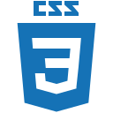

   
  

    
  

  
  <b>@abdulkadirgungor86</b> 

   
  

    
    
  

  

     
   

### :man_technologist: About Me : 
- 👋 Hi, I’m @abdulkadirgungor86
- 👀 I’m interested in "C#" , ".NET Core MVC", "Architecture Patterns(N-Tier and Onion)" and "SOLID Principles"
- 🌱 I’m currently learning React
- 💞️ I’m looking to collaborate on "C#" and ".NET Core MVC"
- 📫 How to reach me "abdulkadirgungor.86@outlook.com"
 

 ### :hammer_and_wrench: Languages and Tools :

  <a href="https://github.com/abdulkadirgungor86/">
    &nbsp;
  </a>
  <a href="https://github.com/abdulkadirgungor86/">
    &nbsp;
  </a>
  <a href="https://github.com/abdulkadirgungor86/">
    &nbsp;
  </a>
  <a href="https://github.com/abdulkadirgungor86/">
    &nbsp;
  </a>
  <a href="https://github.com/abdulkadirgungor86/">
    &nbsp;
  </a>
  <a href="https://github.com/abdulkadirgungor86/">
    &nbsp;
  </a>
  <a href="https://github.com/abdulkadirgungor86/">
    &nbsp;
  </a>
  <a href="https://github.com/abdulkadirgungor86/">
    &nbsp;
  </a>
  <a href="https://github.com/abdulkadirgungor86/">
    &nbsp;
  </a>
  <a href="https://github.com/abdulkadirgungor86/">
    &nbsp;
  </a>

  
   
 

   
 

### 📝 🇹🇷   Turkish Documents :
  &emsp;You can access some of the documents I have prepared from the link below.
  
  &emsp;[Hazırladığım bazı dökümanlara aşağıdaki linkten ulaşabilirsiniz.]
   
   - Block Zinciri Teknolojisi
   - Malware Analizi: Örnek Bir Uygulama Geliştirmesi ve Değerlendirmesi
   - Bir Siber Saldırı Senaryousu
   - Snort Programı
   - USB Belleğin FTK Imager Programı ile İncelenmesi
   - Veritabanı: MySQL Uygulaması
   - Yapay Zekanın Kullanım Alanları ve Geleceği
   
  &emsp; ***...***
   
  

    &emsp;
    
 
 

  

